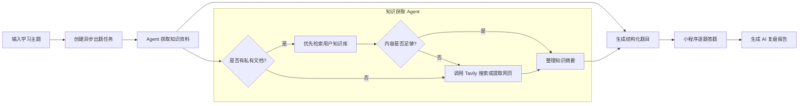

# AI 答题学习助手

一个基于微信小程序的 AI 闯关学习助手。用户可以输入想学习的主题，或上传自己的学习资料，系统会结合大模型、联网搜索和私有知识库生成一套闯关题；完成答题后，系统会给出掌握度、薄弱知识点、知识总结和下一步学习建议。

## 项目能做什么

- **AI 闯关出题**：输入一句话、一个主题或一段学习目标，自动生成单选题、多选题和判断题。
- **联网搜索补充知识**：针对时效性或专业性主题，Agent 可以使用 Tavily 搜索和网页内容提取工具获取最新资料。
- **私有知识库出题**：上传 PDF、Word、Markdown 或纯文本文件，解析、分块并向量化后，基于指定文档生成题目。
- **Agentic RAG**：知识库出题时优先检索用户的私有文档，内容不足时再按需使用联网搜索补充，并输出给出题链作为参考上下文。
- **答题即时反馈**：支持单选、多选和判断题，提交后立即显示对错、正确答案和题目解析。
- **AI 复盘报告**：答题结束后生成正确率、掌握度、薄弱知识点、三行知识总结和学习建议。
- **题目配图**：可选调用文生图模型，为题目生成配图并保存到对象存储。
- **学习记录与个人中心**：微信登录后保存闯关记录、答题统计、平均正确率和经验值，支持从历史记录查看报告。
- **知识库管理**：查看文档解析状态和知识片段数量，删除不再需要的文档，并从已就绪文档直接开始闯关。

## Agent 工作流程

下面的流程图描述了一次从用户输入到完成复盘的主要链路。该图使用 GitHub 支持的 Mermaid 语法，直接在 README 中渲染。



### Agent 的职责

- **联网搜索 Agent**：使用 `create_react_agent` 编排 Tavily 工具，针对用户主题自主选择轻量搜索、深度搜索或 URL 内容提取。
- **知识库 Agent**：使用限定 `user_id` 和 `doc_id` 的向量检索工具，保证出题只读取当前用户指定的文档；必要时再调用联网搜索工具。
- **出题链**：将用户输入和知识摘要交给 DeepSeek，使用 Pydantic 结构化输出生成可校验的题库 JSON。
- **报告链**：根据题目和答题记录计算统计信息，再由大模型生成结构化复盘报告。

## 技术栈

### 前端

- 微信小程序
- Taro 4
- React 18
- TypeScript
- Sass
- Taro API：网络请求、文件选择、微信登录和用户头像授权

### 后端

- Python 3.11+
- FastAPI
- Pydantic v2 / pydantic-settings
- aiomysql + MySQL
- JWT 鉴权
- structlog 日志
- pytest 测试

### AI 与数据处理

- LangChain：Prompt、模型调用和结构化输出
- LangGraph：基于 ReAct 的 Agent 工具编排
- DeepSeek：题目和复盘报告生成
- Tavily：联网搜索与网页内容提取
- DashScope `text-embedding-v4`：文档向量化
- Chroma：本地持久化向量数据库
- PyPDF / docx2txt / TextLoader：文档解析
- 腾讯云 COS：题目配图对象存储

## 项目结构

```text
backend/
  app/
    api/          FastAPI 路由
    core/         配置、数据库、鉴权和安全能力
    llm/          题目与报告生成链
    models/       Pydantic 和数据库模型
    prompts/      出题、搜索、RAG、报告 Prompt
    repositories/ 数据访问层
    services/     出题、搜索、RAG、知识库和用户业务
  tests/          后端测试
  requirements.txt

frontend/
  src/
    pages/        首页、答题、报告、个人中心和知识库页面
    services/     前端 API 封装
  config/         开发和生产环境配置
  package.json

docs/             设计文档和本地运行说明
openspec/         变更提案与设计记录
```

## 本地运行

### 1. 准备后端环境

```bash
cd backend
python -m venv venv
```

Windows PowerShell：

```powershell
.\venv\Scripts\Activate.ps1
pip install -r requirements.txt
```

复制环境变量模板并填写自己的配置：

```powershell
Copy-Item .env.example .env
```

至少需要根据使用场景配置 DeepSeek；如需联网搜索、知识库或题目配图，还需要配置对应的 Tavily、DashScope、微信和对象存储参数。`.env` 只保存在本地，禁止提交到 Git。

### 2. 启动后端

```bash
cd backend
python -m uvicorn app.main:app --reload --host 0.0.0.0 --port 8000
```

启动后可访问 FastAPI 文档：`http://localhost:8000/docs`。

### 3. 安装并启动前端

```bash
cd frontend
npm install
npm run dev:weapp
```

使用微信开发者工具打开前端生成的 `dist` 目录，并根据 `frontend/config/dev.ts` 配置后端 API 地址。

## 配置与安全

- 真实 API Key、微信 AppSecret、JWT 密钥、数据库密码和 COS 密钥必须通过本地 `.env` 或部署平台的环境变量注入。
- 不要提交 `.env`、上传文件、Chroma 数据目录、构建产物、证书或私钥。
- 生产环境应关闭调试模式，使用随机且足够长的 `JWT_SECRET`，并限制数据库、对象存储和模型 API 的权限范围。
- 用户上传的文档和向量数据按用户隔离；部署时应为 `backend/data` 配置可靠的持久化和访问权限。

## 测试

在后端虚拟环境中运行：

```bash
cd backend
pytest
```

前端构建检查：

```bash
cd frontend
npm run build:weapp
```
